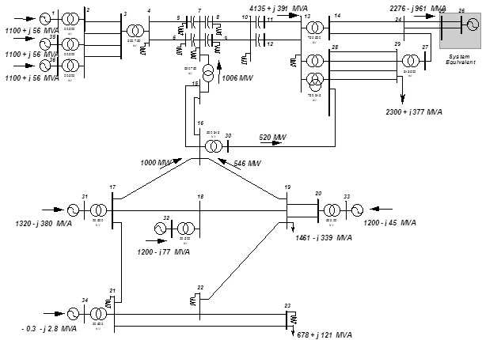

# Pré-Classificador de Estabilidade Transitória de Sistemas Elétricos de Potência 
## Resumo
Este repositório faz parte da monografia "ANÁLISE DE ESTABILIDADE TRANSITÓRIA UTILIZANDO MÁQUINAS DE APRENDIZADO: UMA ABORDAGEM BASEADA EM REDES NEURAIS ARTIFICIAIS E SVM", dentro das disciplinas Trabalho Final de Curso I e II, realizada para o Departamento de Engenharia Elétrica da Faculdade de Arquitetura, Engenharia e Tecnologia da Universidade Federal de Mato Grosso, como requisito parcial para a obtenção do título de Bacharel em Engenharia Elétrica, sob orientação do Prof. Dr. Carlos Enrique Portugal Poma.

Consiste em simular, estática e dinâmicamente, um sistema elétrico de potência de grande porte e construir um pré-classificador com RNA e outro com SVM, com o intuito de classificar a estabilidade transitória do sistema baseando-se em dados de plotagem de variáveis no domínio do tempo.

As simulações foram feitas nos softwares do Centro de Pesquisas de Energia Elétrica (Cepel) Anarede e Anatem, cujo resultados servem de dados de entrada dos códigos presentes nesse repositório.

{align=center}

> ### Links
> - Fonte dos arquivos para Anarede e Anatem (.pwf, .stb, .cdu): <https://sites.google.com/site/powersystemdata/brazilian-data/brazilian-34-bus?pli=1>
> - Arquivos histórico (.sav), de controles (.cdu), de máquinas (.dat) e de contingências (.ctg) utilizados: <https://drive.google.com/drive/folders/1xXZFHoGd8ZUQkkD2WuISXRhzVknkqyiF?usp=sharing>
> - Arquivos de saída do Anatem (.plt): <https://drive.google.com/drive/folders/15BRDT1TS1L3VArYRbQgFwjYP3MQA8a4s?usp=sharing>
> - Arquivos-fonte dos dados de entrada dos algoritmos: <https://drive.google.com/drive/folders/10JGhNuIDKOV3XFDbW5PG6gS3LQ7qPyfj?usp=sharing>

### Sumário
- pltWrapper: script de extração dos dados de plotagem das variáveis de saída do Anatem (refeito após a conclusão do trabalho; a primeira versão estava muito confusa e mal estruturada).
### Em Construção

